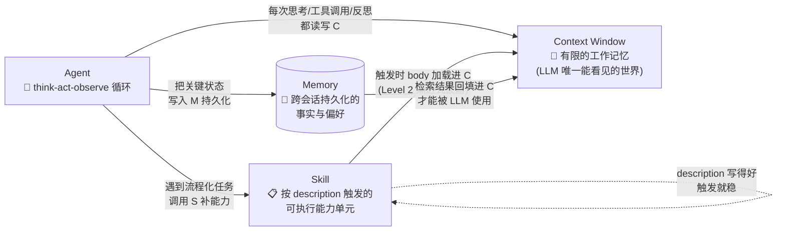

# 作业提交说明（给老师查阅用）

> **作业题目**：使用 AI Skill 工具生成 AI 概念学习资料
> **作者**：Zxz124
> **完成日期**：2026-09-07
> **GitHub 仓库**：[https://github.com/Zxz124/ai-concept-learning-hub](https://github.com/Zxz124/ai-concept-learning-hub)
> **仓库状态**：公开（无需登录、无需权限即可访问全部内容）

---

## 一、本作业做了什么

我按照作业要求，分 7 步在 GitHub 上完成了一个完整、可追溯、可复用的 AI 概念学习资料生成工具：

1. **建仓库**：在 GitHub 创建公开仓库 `ai-concept-learning-hub`
2. **基础文件**：配置 `.gitignore`（排除 `.env`、`.key`、`.pem`、`config/`、`secrets/` 等敏感文件）
3. **写 Skill**：在 `.workbuddy/skills/concept-learner/SKILL.md` 设计了一个「概念学习卡片」生成器（输入概念名 → 自动产出结构化卡片）
5. **跑 Skill 生成资料**：调用该 Skill 学习三个概念（Agent / 大模型的上下文 / Skill），产出三份 Markdown 卡片
6. **写关系文档**：用自己的话阐述三个概念之间的关系（含 Mermaid 流程图与个人判断）
7. **写 README**：说明调用方式、AI 与人工分工、隐私处理
8. **提交上线**：commit + push 到 GitHub 公开仓库

---

## 二、查阅入口（按重要性排序）

老师只需按以下顺序点开即可快速了解本次作业全貌：

| 顺序 | 文件 | 路径 | 用途 |
| --- | --- | --- | --- |
| ① | README.md | [查看](https://github.com/Zxz124/ai-concept-learning-hub/blob/main/README.md) | 5 分钟读懂仓库用途、Skill 用法、AI/人工分工 |
| ② | Skill 文件 | [查看](https://github.com/Zxz124/ai-concept-learning-hub/blob/main/.workbuddy/skills/concept-learner/SKILL.md) | 我设计的「概念学习卡片」生成器（核心交付） |
| ③ | 概念关系 | [查看](https://github.com/Zxz124/ai-concept-learning-hub/blob/main/learning-materials/concept-relationship.md) | 三概念的关系图与个人判断 |
| ④ | Agent 卡片 | [查看](https://github.com/Zxz124/ai-concept-learning-hub/blob/main/learning-materials/agent.md) | 调用 Skill 产出的样例 1 |
| ⑤ | 上下文卡片 | [查看](https://github.com/Zxz124/ai-concept-learning-hub/blob/main/learning-materials/llm-context.md) | 样例 2 |
| ⑥ | Skill 卡片 | [查看](https://github.com/Zxz124/ai-concept-learning-hub/blob/main/learning-materials/skill.md) | 样例 3 |

**直达文件夹**：[learning-materials/](https://github.com/Zxz124/ai-concept-learning-hub/tree/main/learning-materials) · [.workbuddy/skills/](https://github.com/Zxz124/ai-concept-learning-hub/tree/main/.workbuddy/skills)

---

## 三、关键设计决策（供评分参考）

### 1. Skill 设计中的几个"硬约束"

我在 `concept-learner` Skill 里写了以下纪律，并在执行时严格遵守：

- **来源必须真实可访问**：每个引用 URL 都通过 WebFetch 实测返回 200，写访问日期
- **找不到的来源必须标"待补"，禁止编造**：宁可空着也不许写假论文/假 DOI
- **概念辨析选"用户真会搞混的"**：不是 Wikipedia 摘要堆砌
- **自测题必须分层**：理解 / 应用 / 分析 三档各一道
- **边界与陷阱不许跳过**：这是 Skill 自检里明确写明的"最有价值的部分"

### 2. AI 与人工分工的诚实拆分

| 角色 | 做了什么 |
| --- | --- |
| **AI 起草** | Skill 文件、三张学习卡片、概念关系文档、README 全部内容 |
| **人工决策** | 仓库架构（用项目级 Skill 而非仓库级）、选题范围（选哪三个概念）、安全规则（.gitignore 覆盖范围）、风格要求（必须体现个人理解）、流程卡点（一步一步确认） |
| **坦白** | 三张卡片只经过 AI 一轮自审，未经人类逐字校对；agent.md 末尾已标注 |

### 3. 隐私保护

`.gitignore` 已覆盖：`.env`、`.env.*`、`*.key`、`*.pem`、`*.keystore`、`config/`、`secrets/`、以及按文件名兜底的 `*credentials*`/`*password*`/`*api_key*`/`*secret*`/`.netrc`/`.npmrc` 等。仓库全程没有出现任何 API Key、token、个人隐私数据。

---

## 四、本仓库的可复用性

任何人都可以按以下三步复制这套工作流：

1. Fork 或 Clone 本仓库
2. 在自己环境里打开 WorkBuddy
3. 对 AI 说："**使用 concept-learner 学习 [任意概念名]**" 即可生成同等质量的概念学习卡片

Skill 是声明式的——读 SKILL.md 就能复现完整工作流，不需要任何额外配置。

---

## 五、自查清单结果

提交前自查 7 项全部通过：✅
- ① Skill 文件含 YAML 元数据 ✓
- ② 三份学习资料完整（机制/场景/边界/来源齐全）✓
- ③ 概念关系文档含个人判断 ✓
- ④ README 完整说明调用方式与人工修改过程 ✓
- ⑤ .gitignore 排除敏感文件 ✓
- ⑥ commit + push 完成（commit hash: bff2111）✓
- ⑦ 仓库公开可访问（HTTP 200 无认证、private: False）✓

---

**完整资料已全部公开托管在 GitHub，欢迎老师审阅。**# 📚 ai-concept-learning-hub

> 个人 AI 概念学习资料生成工具与学习笔记仓库

---

## 这是什么

这是一个**两用仓库**：

1. **工具侧** —— 自带一个名为 `concept-learner` 的项目级 Skill。当你给它一个概念名（不限 AI 领域），它会按固定模板生成结构化的"概念学习卡片"（定义 / 学习目标 / 核心问题 / 机制 / 场景 / 边界 / 辨析 / 自测 / 来源）。
2. **笔记侧** —— 仓库内 `learning-materials/` 目录收录已经生成好的概念学习资料，可以直接阅读、复习、对外分享。

设计哲学：**让"学概念"这件事可重复、可核查、可演进**——而不是每次问 AI 拿一段聊完就丢。

---

## 仓库结构

```
ai-concept-learning-hub/
├── .gitignore                     # 排除 .env、密钥、证书、配置/私密目录等
├── README.md                      # 你正在读的文件
├── .workbuddy/                    # 项目级 Skill 目录（不进工作目录技能表，仅项目内生效）
│   └── skills/
│       └── concept-learner/
│           └── SKILL.md           # 核心：概念学习卡片生成器
└── learning-materials/            # 已生成的学习资料（按概念分子目录/文件）
    ├── .gitkeep
    ├── agent.md                   # 📘 Agent（AI Agent / 自主智能体）
    ├── llm-context.md             # 📘 大模型的上下文（LLM Context Window）
    ├── skill.md                   # 📘 Skill（AI Agent 中的能力单元）
    └── concept-relationship.md    # 🔗 三个概念的关系说明（含 Mermaid 图）
```

---

## Skill 使用

### 调用方式

1. 在 WorkBuddy 中打开本仓库（作为工作目录）
2. 输入任意一个概念名，例如：
   - `使用 concept-learner 学习 Agent`
   - `用 concept-learner 学一下 "LoRA"`
   - `用 concept-learner 解释 "基尼系数"`
3. Skill 自动按 7 步流程生成卡片，输出到 `learning-materials/<概念>.md`

> 💡 概念名是英文 / 中文都可。遇到歧义（如 "Skill"、"Attention"），Skill 会先反问确认你指的是哪个含义。

### 当前 Skill 行为要点

- **强制引用核查**：每个引用 URL 必须经过实际访问验证，不许编造论文 / DOI / 博客标题
- **找不到的来源**：会标 `[来源待补]`，绝不凑数
- **输出三要素必备**：核心机制 + 应用场景 + 边界陷阱，缺一不可
- **自测题分层**：理解 / 应用 / 分析三档，每道附答案要点

详见：`.workbuddy/skills/concept-learner/SKILL.md`

### 已生成的资料

| 文件 | 内容 | 主要来源 |
| --- | --- | --- |
| `learning-materials/agent.md` | Agent 的四要素架构、与 Workflow 的边界 | Lilian Weng 2023 综述 + Anthropic 2024 工程指南 |
| `learning-materials/llm-context.md` | 上下文窗口机制、Lost in the Middle、context rot | arxiv 2307.03172 + Redis 工程博客 |
| `learning-materials/skill.md` | Agent Skills 标准、渐进式披露、与 CLAUDE.md 的区别 | code.claude.com 官方文档 + agentskills.io |
| `learning-materials/concept-relationship.md` | 三个概念作为系统的咬合关系 + 个人判断 | ——（综合卡片 + 个人写作） |

---

## AI 辅助 vs 人工核查

为了对未来的我（或他人）诚实，这里拆清楚**这次会话里 AI 和人工各做了什么**：

### AI（本次会话的对话智能体）生成的部分

- ✅ `.workbuddy/skills/concept-learner/SKILL.md`（232 行，约 8.4 KB）—— 全部由 AI 按用户给的需求规格起草
- ✅ `learning-materials/agent.md`、`llm-context.md`、`skill.md`（共约 250 行）—— AI 按 SKILL.md 工作流生成，包括：
  - WebSearch 多轮检索候选来源
  - WebFetch 验证 URL 可达
  - 按模板填入卡片内容
- ✅ `learning-materials/concept-relationship.md`（162 行）—— AI 起草的关系分析与个人判断
- ✅ `.gitignore` —— AI 按用户规则草拟 + 补全运行时产物兜底
- ✅ 本 README.md（当前文件）

### 人工（用户 Zxz124）做的决策与核查

- 📌 **架构决策**：用项目级 Skill 而非用户级 Skill；放在 `.workbuddy/skills/` 而非 `.claude/skills/`
- 📌 **范围裁剪**：选 Agent / 上下文 / Skill 这三个概念作为初始集
- 📌 **安全规则**：明确指定 `.gitignore` 必须排除 `.env`、`*.key`、`*.pem`、`config/`、`secrets/` 等
- 📌 **风格要求**：明确要求概念关系文档"必须体现个人理解和判断，不能照搬 AI 生成内容"
- 📌 **流程卡点**：每一步完成后等用户确认再进入下一步（避免 AI 一次性跑完全部步骤）

### AI 做了但用户没有逐字审查的部分（坦白说明）

- 三张学习卡片**只做了一轮 AI 自审**（用户授权 AI "逐份阅读、修改、再保存"），未经过人类逐字校对
- 概念关系文档**完全由 AI 起草**，未经人类二次审阅
- 如发现事实错误或表述不顺，欢迎直接改文件并 commit

### 我会怎么建议后续协作

> AI 适合负责：检索 / 整理 / 模板填充 / 来源核查
> 人类适合负责：取舍 / 立场 / 判断 / 终审
>
> 这条分工原则正是这份仓库本身在演示的事。

---

## 隐私与敏感信息

`.gitignore` 当前覆盖范围：

| 类型 | 规则示例 | 说明 |
| --- | --- | --- |
| 环境变量 | `.env`, `.env.*`（保留 `.env.example`） | 用户要求 |
| 密钥 / 证书 | `*.key`, `*.pem`, `*.p12`, `*.pfx`, `*.crt`, `*.cer`, SSH 私钥 | 用户要求 |
| 配置 / 私密目录 | `config/`, `secrets/` | 用户要求 |
| 凭据兜底（按文件名） | `*credentials*`, `*password*`, `*api_key*`, `*access_token*`, `*private_key*`, `*secret*`, `.netrc`, `.npmrc`, `.pypirc`, `.htpasswd` | 用户要求"包含 API Key / 密码 / 隐私" 兜底匹配（gitignore 只能按文件名筛） |
| 运行时产物 | `__pycache__/`, `node_modules/`, `.vscode/`, `.idea/`, `*.log`, `*.tmp` | 顺手加的，避免学习材料误带 |
| 本地草稿 | `drafts/`, `scratch/` | 顺手加的 |

### 还没覆盖但你应该自己评估的

- ❌ 大型二进制文件（建议用 Git LFS 或不放进仓库）
- ❌ 个人身份信息文件（笔记、通讯录）—— 建议不放进仓库，或放到 `private/` 后再加进 `.gitignore`
- ❌ `.DS_Store` / `Thumbs.db` —— 已覆盖

---

## 后续可扩展的方向

- [ ] 给 concept-learner 增加"卡片索引"自动汇总（避免概念多了找不到）
- [ ] 增加 README 模板的多语言版本（中文 / 英文）
- [ ] 增加一个 `templates/` 目录，存放常用 Skill 的写作模板
- [ ] 给每个学习资料加 frontmatter（难度 / 时长 / 标签），方便后续做检索与复习调度

---

## 许可与归属

- 本仓库由用户 Zxz124 创建并维护
- 学习卡片中引用的外部资料版权归原作者所有，链接仅作学习用途
- 仓库本身的组织结构（Skill + learning-materials）欢迎借鉴使用

---

*最后更新：2026-09-07*---
name: concept-learner
description: |
  根据用户给出的任意概念名称，自动生成结构化的"概念学习卡片"。
  适用场景：学习一个新概念、准备面试题、整理读书笔记、写课程讲义、做知识库入库。
  不限于 AI 领域——可以用于任意学科（计算机、经济学、物理、心理学、产品设计等）。
  卡片包含：一句话定义、学习目标、核心问题、机制解释、应用场景、概念辨析、自测题、可核查的参考来源。
  Trigger: "学习概念"、"解释 X"、"什么是 X"、"concept learning"、"knowledge card"、"学习卡片"、"概念辨析"、"教我 X"。
---

# concept-learner — 结构化概念学习卡片生成器

## 1. 适用场景

当用户的意图是**理解一个概念**而不是完成某个工程任务时，使用本 Skill：

- "帮我学一下 RAG"、"解释一下 KV Cache"、"什么是马太效应"
- 准备技术面试 / 写学习笔记 / 整理 Wiki / 制作教学讲义
- 用户给出一个名词，希望拿到一份**可复习、可自测**的结构化材料

**不适用**：
- 用户要的是代码实现、bug 修复、API 调用 → 直接动手做
- 用户只想要一句话定义 → 直接回答，不要拉全套模板
- 概念过于冷门到查不到任何可核查来源 → 先告知用户，再决定是否继续

## 2. 输入信息

最少接收**一个概念名称**（字符串），例如：

- `Agent`
- `大模型的上下文`
- `Skill`（注意歧义——可能是 AI Agent 的 Skill，也可能是人物技能）
- `RAG`、`SFT`、`LoRA`
- `基尼系数`、`反脆弱`、`边际效用`

可选的补充输入（用户给就采纳，不给就走默认值）：

| 参数 | 默认值 | 说明 |
| --- | --- | --- |
| 受众 | 工程师/技术学习者 | 决定解释深度和用词 |
| 篇幅 | 中等（1500-2500 字） | 短/中/长三档 |
| 重点 | 全要素均衡 | 可指定突出"机制"或"应用"或"辨析" |

**遇到歧义概念**（如 "Skill"、"Attention"、"Memory"），先**用一句话反问确认**用户指的是哪个含义，再开始生成。

## 3. 生成步骤（严格按序执行）

### 步骤 1：明确概念的定义与所属领域

- 用**一句话**写出定义（不超过 40 字）
- 标注**所属领域 / 子领域**（例：AI / LLM / Inference；经济学 / 微观；CS / 系统）
- 标注**首次提出时间与提出者**（如果查得到）

### 步骤 2：提炼 3-5 个学习目标

学习目标必须是**可验证的**——读者读完应该能回答"我能不能 X"。

格式：`[动词] + [对象]`，例如：
- ✓ "能用自己的话解释 Transformer 的 self-attention 计算过程"
- ✗ "了解 Transformer"（太虚）

### 步骤 3：围绕概念提出 3 个核心问题

好的核心问题应该满足：

1. 触及概念的本质（"为什么需要它" / "它解决了什么问题"）
2. 触及机制（"它是怎么工作的"）
3. 触及边界（"它和 X 有什么区别 / 什么时候不能用它"）

### 步骤 4：结构化解释

必须包含**三块**，缺一不可：

#### 4a. 核心机制 / 组成
- 拆成 3-5 个组件或步骤
- 必要时用伪代码 / 公式 / 流程图（Mermaid）
- 不超过 300 字

#### 4b. 一个具体应用场景
- 真实存在的场景（不要"假设一个电商网站"这种空壳）
- 走一遍"输入 → 概念介入 → 输出"的完整链路

#### 4c. 容易混淆的问题或使用边界
- 至少列 2 条"看起来对其实是错的"或"在 X 情况下不适用"的提醒
- 标注**陷阱 / 边界**

### 步骤 5：提供 1-2 个概念辨析

用 Markdown 表格对比：

| 维度 | 本概念 | 易混概念 |
| --- | --- | --- |
| 定义 | ... | ... |
| 适用场景 | ... | ... |
| 关键区别 | ... | ... |

易混概念的选择原则：用户大概率会搞混的（同类、相近命名、字面相似），不是冷门到没意义的对比。

### 步骤 6：设计 3 道自测题

每道题附**答案要点**（不是完整答案，是 reviewer 能据此打分的几个关键词）：

- 题 1：**理解**层（能复述）
- 题 2：**应用**层（能举例 / 推导）
- 题 3：**分析 / 辨析**层（能区分易混概念 / 指出边界）

### 步骤 7：列出可核查的参考来源

**这是硬性要求，不能省：**

1. 每个来源必须**真实可访问**——要么是已经验证过的官方文档 / 论文 / 维基百科，要么是你**在本次会话中实际通过 WebFetch / WebSearch 验证过 URL 返回 200** 的
2. **禁止编造**：论文 DOI、博客标题、作者名字、URL 路径——任何编造都是严重违规
3. 如果某条信息**没有可核查来源**，明确标注 `[来源待补]` 而不是捏造一条
4. 至少给出 **2-3 条**链接，理想包含：
   - 1 条**权威来源**（论文 / 官方文档 / 维基百科）
   - 1 条**教程 / 综述**（便于初学）
   - 1 条**应用案例**（可选）

## 4. 输出结构（Markdown 卡片模板）

```markdown
# 📘 [概念名称]

> **一句话定义**：[定义]
> **所属领域**：[领域 / 子领域]
> **首次提出**：[时间 + 人物] 或 [来源待补]

---

## 🎯 学习目标
1. ...
2. ...
3. ...
4. (可选)
5. (可选)

## ❓ 核心问题
1. ...
2. ...
3. ...

## 🔍 结构化解释

### 核心机制 / 组成
- **组件 1**：...
- **组件 2**：...
- ...

### 应用场景
[具体场景描述，走一遍输入→处理→输出]

### 边界与陷阱
- ⚠️ ...
- ⚠️ ...

## 🔀 概念辨析

| 维度 | [本概念] | [易混概念] |
| --- | --- | --- |
| 定义 | ... | ... |
| 适用场景 | ... | ... |
| 关键区别 | ... | ... |

## ✅ 自测题

**1. [题面]**（理解层）
   - 答案要点：...

**2. [题面]**（应用层）
   - 答案要点：...

**3. [题面]**（分析层）
   - 答案要点：...

## 📚 参考来源（可核查）

1. [标题](真实URL) — 来源类型（论文/官方文档/教程）；访问日期 YYYY-MM-DD
2. ...
3. ...

---
*本卡片由 `concept-learner` Skill 生成*
```

## 5. 来源核查纪律

| 必须做 | 禁止做 |
| --- | --- |
| WebSearch 检索 + WebFetch 验证 URL 返回 200 | 凭"印象"写出 DOI、博客标题、URL |
| 优先用 arxiv / 官方 docs / wiki / IEEE / ACM | 引用内容农场 / AI 生成站 / 软文 |
| 标注访问日期 | 把不可达的链接混进列表 |
| 找不到 → 写 `[来源待补]` | 编造一条凑数 |

**验证流程**（每个引用过一遍）：
1. WebSearch 查概念 → 取候选链接
2. WebFetch 该链接 → 确认 200 且内容相关
3. 写入卡片时附 `[来源类型] | 访问日期`

## 6. 自检清单（输出前逐项过一遍）

- [ ] **准确性**：机制描述是否与可核查来源一致？是否有"看起来对但其实错"的地方？
- [ ] **易懂性**：目标受众能否在 5 分钟内理解核心机制？是否避免了未解释的术语堆砌？
- [ ] **三要素齐备**：核心机制 + 应用场景 + 边界陷阱，三块都在吗？
- [ ] **辨析到位**：选出的易混概念是不是用户真正会搞混的那个？
- [ ] **自测题分层**：3 道题是不是分别覆盖理解 / 应用 / 分析？答案要点够具体吗？
- [ ] **来源真实**：所有 URL 都验过返回 200？标注了访问日期？有没有 `[来源待补]` 漏写？
- [ ] **非照搬**：是不是用自己的话重新组织的？还是直接从某处复制粘贴？

## 7. 最小调用示例

**用户**：`用 concept-learner 学一下 "LoRA"`

**你的响应**：
1. 不歧义 → 直接生成
2. 按步骤 1-7 走完整流程
3. 输出上面模板的完整卡片
4. 不要写"以下是卡片"这种过渡句——直接输出卡片本身

**用户**：`用 concept-learner 学一下 "Skill"`

**你的响应**：
1. 识别歧义 → 先问："你说的 Skill 指的是：(a) AI Agent 中的能力单元 / (b) 人物的技能 / (c) 其他？"
2. 用户回答后 → 进入正常生成流程

## 8. 反模式（明确不要做）

- ❌ 编造论文标题、作者、DOI、URL
- ❌ 用"可能在某篇文章里提到过"代替真实链接
- ❌ 把整段对话 / 整篇博客原文复制进卡片
- ❌ 自测题只写"请简述 X"不附答案要点
- ❌ 把概念辨析做成"两个概念各自的 Wikipedia 摘要拼接"
- ❌ 长度失控：每个学习目标写 200 字（目标要精炼）
- ❌ 跳过边界 / 陷阱部分（这是最有价值的部分）# 📘 Agent（AI Agent / 自主智能体）

> **一句话定义**：能感知环境、自主规划、调用工具并采取行动以完成目标的 AI 系统，通常以 LLM 作为推理核心。
> **所属领域**：AI / LLM / Agentic Systems（智能体系统）
> **首次提出**：经典"Intelligent Agent"概念源自 AI 早期；LLM-based Agent 的现代架构由 Lilian Weng 于 2023-06-23 在《LLM Powered Autonomous Agents》中系统化。
> **辨析提示**：本卡片聚焦"LLM-based Agent"。Anthropic 2024 进一步区分了 *workflow* 与 *agent* 两种 agentic system 范式。

---

## 🎯 学习目标
1. 能用自己的话复述 LLM Agent 的四要素（LLM + 规划 + 记忆 + 工具）及其相互作用
2. 能区分 Workflow（代码控制流）与 Agent（模型控制流）的本质差异
3. 能判断一个任务应该用 Workflow 还是 Agent（"先简单再复杂"原则）
4. 能列举 ReAct、Chain-of-Thought、Reflexion 等关键技术名词并解释其作用

## ❓ 核心问题
1. 为什么 LLM 本身"不够用"——为什么需要把它包装成 Agent？
2. Agent 和 Workflow 在"控制权归属"上有什么本质区别？
3. 什么情况下**不该**用 Agent？（避免过度设计）

## 🔍 结构化解释

### 核心机制 / 组成

基于 Lilian Weng 2023 年的综述 [1]，一个 LLM Agent 由四个核心组件构成：

1. **LLM（大脑）**——负责理解输入、推理、决策、生成响应，相当于系统的"中央处理器"。
2. **规划（Planning）**：
   - **任务分解**：将复杂目标拆为可执行的子目标（Chain-of-Thought、Tree of Thoughts）
   - **反思 / 自我批评**：ReAct、Reflexion、Chain of Hindsight 等框架让 Agent 从错误中学习
3. **记忆（Memory）**：
   - **短期记忆**：当前对话上下文（in-context learning）
   - **长期记忆**：外部向量数据库（FAISS、Chroma、Pinecone 等），通过 ANN 算法检索
4. **工具（Tools）**：通过 API 调用、function calling、代码执行扩展 LLM 自身能力边界

Agent 通过 **"思考 → 行动 → 观察"（think-act-observe）** 循环运行，直到任务完成或达到停止条件（最大迭代次数 / 检查点 / 阻塞错误）[2]。

### 应用场景

**典型案例：开放式编程任务（SWE-bench 风格）**
- 用户："修复这个开源仓库的 issue #123"
- Agent 流程：
  1. 用文件工具读取仓库，理解代码结构
  2. 规划要修改哪些文件、需补充哪些测试
  3. 工具调用：编辑文件 → 跑测试 → 读报错
  4. 反思：测试失败 → 修改代码 → 再跑测试（迭代）
  5. 提交 PR 或汇报修复结果

Anthropic 在自家工程博客里就把 SWE-bench coding agent 作为 agentic 模式的典型用例 [2]。

### 边界与陷阱

- ⚠️ **Agent ≠ 复杂框架**。Anthropic 反复强调："Consistently, the most successful implementations use simple, composable patterns rather than complex frameworks"——很多团队硬塞 LangChain/AutoGen，结果比"LLM 在循环里调工具"的几十行代码更难调试 [2]。
- ⚠️ **Agent 适合开放性问题**（步骤数难以预知），**Workflow 适合明确任务**（流程可枚举）。用 Agent 处理固定流程反而引入不确定性。
- ⚠️ **自主性越强，误差累积越大**。多轮 LLM 调用的小错可能在第 10 轮变成致命错——Anthropic 建议在沙盒环境做充分测试 [2]。
- ⚠️ **常见误解**：以为调了 LangChain / AutoGen / CrewAI 就"做了 Agent"。其实"LLM 在循环里根据反馈调用工具"已经是 Agent 的全部核心——框架是脚手架，不是本质。

## 🔀 概念辨析

| 维度 | Agent（自主智能体） | Workflow（工作流） | 普通 LLM 调用 |
| --- | --- | --- | --- |
| **控制权归属** | LLM 动态决定路径 | 代码预设路径 | 无路径，单轮调用 |
| **步骤数** | 不固定，运行时决定 | 固定，由编排代码决定 | 1 步 |
| **适用场景** | 开放问题、不可预测步骤 | 明确任务、固定子任务 | 简单问答 / 生成 |
| **成本 / 延迟** | 高（多轮推理） | 中（按部就班） | 低 |
| **失败模式** | 误差累积、可能跑偏 | 单点失败可控 | 无累积 |
| **典型例子** | SWE-bench coding agent | Prompt chaining、Routing、Parallelization | 单轮问答 |

> Workflow 又细分为五种模式（按复杂度递增）：Prompt Chaining → Routing → Parallelization → Orchestrator-Workers → Evaluator-Optimizer [2]。

## ✅ 自测题

**1.（理解层）用自己的话复述 Agent = LLM + Planning + Memory + Tools 四要素中每个组件的作用。**
- 答案要点：LLM=推理核心；Planning=任务分解+反思；Memory=短期上下文+长期向量库；Tools=扩展 LLM 能力边界（API/函数/代码）；四者通过 think-act-observe 循环串起来。

**2.（应用层）给定任务"自动帮用户预订去东京出差的行程"。请描述 Agent 会如何规划与调用工具。**
- 答案要点：拆解子任务（查航班/比酒店/查日历/核对差旅政策）；用偏好（长期记忆）避免重复询问；调用 Google Flights API、酒店 API、日历 API；若首选航班售罄，自主调整方案；最后呈现完整行程或在授权后直接下单。

**3.（分析层）为什么"客服 + 自动退款"场景比"营销文案生成 + 多语言翻译"场景更适合用 Agent？**
- 答案要点：客服流程依赖对话分支、需读取外部数据（订单/工单/知识库）、动作可程序化执行（退款/改单）、结果可衡量——满足 Anthropic 提出的 Agent 适用条件；文案生成+翻译是固定两步序列，更适合 Prompt Chaining 这种 Workflow（甚至单轮 LLM + 后处理就够）。

## 📚 参考来源（可核查）

1. Lilian Weng. *LLM Powered Autonomous Agents*. Lil'Log, **2023-06-23**. [https://lilianweng.github.io/posts/2023-06-23-agent/](https://lilianweng.github.io/posts/2023-06-23-agent/) — 综述博客（首次系统化 LLM Agent = LLM + Planning + Memory + Tools 架构）| 访问日期 2026-09-07
2. Erik Schluntz & Barry Zhang. *Building effective agents*. Anthropic Engineering Blog, **2024-12-19**. [https://www.anthropic.com/engineering/building-effective-agents](https://www.anthropic.com/engineering/building-effective-agents) — 工程指南（区分 Workflow vs Agent，提出"先简单再复杂"原则）| 访问日期 2026-09-07
3. Anthropic. *Building Effective AI Agents*. [https://www.anthropic.com/engineering/building-effective-agents](https://www.anthropic.com/engineering/building-effective-agents) — Anthropic 官方工程指南（同 engineering 文章）；`/research/` 路径是镜像页，访问会 307 跳转到本链接 | 访问日期 2026-09-07

---
*本卡片由 `concept-learner` Skill 生成*# 📘 大模型的上下文（LLM Context Window）

> **一句话定义**：语言模型在单次生成响应时可参考的全部文本容量（含输入+输出），以 token 为单位计量，相当于模型的"工作记忆"。
> **所属领域**：AI / LLM / Transformer 架构
> **首次提出**：作为 Transformer 架构（Vaswani et al., 2017, *Attention Is All You Need*）的固定序列长度属性；现代 LLM 通过 RoPE、位置插值、Flash Attention、YaRN 等技术不断扩展上限。
> **辨析提示**：本卡片聚焦"上下文窗口"概念；与"训练数据""持久记忆""模型参数"均不同。

---

## 🎯 学习目标
1. 能用自己的话解释 Context Window 的定义、计量单位（token）、与训练数据的区别
2. 能说出主流模型的上下文窗口规模（GPT-4o ~128K、Claude Sonnet 4 ~1M、Gemini 2.5 Pro ~1M）
3. 能解释 "Lost in the Middle" 现象及其对长上下文设计的启示
4. 能区分 Context Window、Context Length、Memory、Training Data 四个常被混淆的概念

## ❓ 核心问题
1. 为什么"窗口更大 = 效果更好"是个常见误解？
2. Context Window 和模型"记住"的内容（训练数据、长期记忆）是什么关系？
3. 上下文塞得越满越好吗？为什么"塞更多"反而会让准确率下降？

## 🔍 结构化解释

### 核心机制 / 组成

1. **Token 化**：输入文本先经分词器（BPE 等子词算法）切成 token；经验值：1 token ≈ 4 个英文字符 ≈ ¾ 个英文单词（不同语言/格式浮动）[1]
2. **Transformer 自注意力**：每个 token 与窗口内所有其他 token 两两计算注意力权重；窗口长度 N 时，复杂度 O(N²)——10K token 要 1 亿次比较，100K token 要 100 亿次 [1]
3. **容量边界**：训练时设定的最大序列长度（如 8K、128K、1M），超过则截断或报错；可通过位置插值、YaRN、RoPE 扩展、稀疏注意力等突破训练上限 [1]
4. **KV Cache**：生成每个新 token 时缓存所有前序 token 的 Key/Value 向量，是 GPU 显存的主要消耗者——这是窗口越大推理越慢的根本原因 [1]
5. **计算瓶颈**：上下文越长，self-attention 计算量、显存占用、延迟都急剧增长；Flash Attention 通过分块计算将显存复杂度从 O(N²) 降到 O(N)，但不能消除计算复杂度 [1]

### 应用场景

**RAG（检索增强生成）场景下的上下文管理**：
- 输入构成：用户问题 + 检索回来的 5 段相关文档 + 系统提示 + 历史对话 + 预留输出空间
- 关键策略：
  1. 把检索结果按相关性重排，让关键证据排在 prompt 的开头或结尾（避开"Lost in the Middle"的中间塌陷区）
  2. 用 prompt caching（Anthropic / OpenAI 都支持）复用相同前缀以省成本
  3. 必要时启用"上下文压缩"（compaction）或滑窗式摘要
- 决策原则：**窗口大小是预算，相关性是质量**——把最有用的内容放进去，比塞满所有可能相关的内容更关键

### 边界与陷阱

- ⚠️ **Lost in the Middle** [2]：Liu et al. 2023 的实证研究表明，当相关信息位于长上下文的**中间**位置时，模型准确率显著下降，呈 U 型曲线——只有头尾用得好。即使是专为长上下文设计的模型也未能完全消除（虽然幅度缩小）。
- ⚠️ **Context Rot（上下文腐化）**：随着 token 数量增长，准确率和召回率都会下降；"更多 token" 不自动等于"更好结果"。Anthropic 文档中明确使用了"context rot"一词（来源 URL 在本环境区域受限未直接验证，通过多份独立分析间接引用 [1]）。
- ⚠️ **不要把"最大窗口"当"可用窗口"**：许多长上下文模型在 ~32K 后就开始掉点；务必用你自己的数据实测目标上下文长度下的表现。
- ⚠️ **Context Window ≠ Memory**：Window 是会话内、易失的；Memory 是跨会话持久化的外部存储。窗口随时可能重置，必须把关键状态写到 memory 文件里。

## 🔀 概念辨析

| 维度 | Context Window | Context Length | Memory（持久记忆） | Training Data |
| --- | --- | --- | --- | --- |
| **是什么** | 模型可参考的实时输入范围 | Context Window 的同义别名 | 跨会话持久化的外部存储 | 训练时喂入的全部语料 |
| **容量** | 固定（如 200K token） | 同左 | 理论上无限 | 数 TB ~ 数 PB |
| **时效性** | 会话内有效 | 同左 | 跨会话 | 训练快照 |
| **写入方式** | 每次请求重新组装 | 同左 | 用户 / Agent 显式写入 | 训练阶段固化 |
| **比喻** | 短期工作记忆 | 同义 | 长期笔记 / 外部硬盘 | 一辈子的阅历 |

## ✅ 自测题

**1.（理解层）用一句话定义 Context Window，并指出它和 Training Data 的本质区别。**
- 答案要点：Context Window 是模型在生成响应时可参考的全部文本（含输入+输出），是会话级的"工作记忆"；Training Data 是训练时使用的语料库，是模型"一辈子读过的书"。前者每次请求重新组装，后者训练后冻结。

**2.（应用层）你正在做一个 100 页 PDF 问答系统，模型是 GPT-4o（128K 窗口）。请列出 3 个上下文管理策略。**
- 答案要点：① 把 PDF 切片做 RAG，只把最相关的 5-10 段塞进窗口；② 关键问题/答案放在 prompt 的开头或结尾（避开中间）；③ 使用 Anthropic / OpenAI 的 prompt caching 复用相同前缀以省成本；④ 必要时启用上下文压缩（compaction）或分轮摘要。

**3.（分析层）为什么 "Lost in the Middle" 对 RAG 系统设计是个重要警示？**
- 答案要点：RAG 默认按相关性打分排序，把最相关文档放最前——但研究显示模型对中间位置内容利用度低；启示是检索结果的最终排序不能只按相关性，还要让关键证据出现在 prompt 开头或结尾，并控制总长度避免"中间塌陷"。这是检索排序策略（召回侧）和 prompt 组装策略（生成侧）的耦合点。

## 📚 参考来源（可核查）

1. Jim Allen Wallace. *LLM context windows: Understanding and optimizing working memory*. Redis Blog, **2026-01-23**. [https://redis.io/blog/llm-context-windows/](https://redis.io/blog/llm-context-windows/) — 工程实践指南（含 O(N²) 注意力、KV Cache、Flash Attention 等机制解释 + 各模型窗口规模表）| 访问日期 2026-09-07
2. Nelson F. Liu, Kevin Lin, John Hewitt, Ashwin Paranjape, Michele Bevilacqua, Fabio Petroni, Percy Liang. *Lost in the Middle: How Language Models Use Long Contexts*. **arXiv:2307.03172**, TACL 2023. [https://arxiv.org/abs/2307.03172](https://arxiv.org/abs/2307.03172) — 学术论文（首次系统化 U-shape 准确率曲线现象）| 访问日期 2026-09-07

---
*本卡片由 `concept-learner` Skill 生成*# 📘 Skill（AI Agent 中的能力单元 / Agent Skills）

> **一句话定义**：在 AI Agent 框架中，"Skill" 是一个包含 `SKILL.md` 的目录，作为模型可按需加载的可调用能力单元——由模型根据任务描述自主判断何时调用，而非用户手动选择。
> **所属领域**：AI / Agentic Systems / 工具与能力扩展
> **首次提出 / 标准来源**：由 Anthropic 最初提出，发布为 **Agent Skills 开放标准**（[agentskills.io](https://agentskills.io/home)），现已被 Claude Code、Cursor、GitHub Copilot 等多工具采纳。
> **辨析提示**：本卡片聚焦"Agent Skill"。其他常见含义（人类技能、游戏 Skill 树、Windows PowerShell Skill 等）不在此展开。如需切换含义请告知。

---

## 🎯 学习目标
1. 能用自己的话解释 Agent Skill 的核心定义（SKILL.md + 渐进式披露）
2. 能区分 Personal Skill、Project Skill、Plugin Skill 三种存放位置及其适用场景（Claude Code 官方文档明确区分前两类，第三类 Plugin Skill 由后续生态延展 [1]）
3. 能说出 Skill 与 CLAUDE.md / Subagent / Tool Calling 的区别
4. 能描述 Skill 的三级加载机制（metadata → body → supporting files）

## ❓ 核心问题
1. Skill 和 CLAUDE.md 有什么区别？为什么要发明 Skill 这个新抽象？
2. Skill 是用户调用的还是模型调用的？这种"模型调用"的设计有什么好处和代价？
3. 一个项目应该把所有能力都做成 Skill 吗？还是只在某些场景下用？

## 🔍 结构化解释

### 核心机制 / 组成

基于 Anthropic 推出的 Agent Skills 开放标准 [2] 和 Claude Code 官方文档 [1]：

1. **Skill 的物理形态**：一个目录（如 `.claude/skills/<name>/`），其中必须有 `SKILL.md` 文件，可附带脚本、模板、参考文档等支持文件
2. **SKILL.md 结构**：
   - **YAML frontmatter**：`name`、`description`（**最重要**——决定模型何时调用此 skill）
   - **Markdown body**：使用该 skill 的完整指令、步骤、示例
3. **渐进式披露（Progressive Disclosure）三级加载** [2]：
   - **Level 1（启动时）**：仅加载 frontmatter（name + description，约 100 tokens/skill）
   - **Level 2（触发时）**：完整 SKILL.md body 加载（~5K tokens）
   - **Level 3（按需）**：supporting 文件 / 脚本仅在被引用时加载
4. **模型自主调用（Model-Invoked）**：description 字段是模型决定何时加载该 skill 的核心信号；用户也可以 `/skill-name` 显式调用 [1]

> ⚙️ **路径差异**：Claude Code 使用 `.claude/skills/`；本仓库的 `concept-learner` Skill 按 WorkBuddy 约定放在 `.workbuddy/skills/`。概念相同，路径随工具而变。

### 应用场景

**典型用例：项目级 Skill（共享给团队）**
- 场景：团队想把"部署到 staging 环境"这一重复过程封装给 Claude
- 实现：在 `.claude/skills/deploy-to-staging/SKILL.md` 中写好部署步骤、SSH 命令、安全检查清单
- 工作流：
  1. Claude Code 启动 → 发现 `.claude/skills/` 目录 → 加载所有 skill 的 frontmatter
  2. 用户说"帮我部署这个 PR" → Claude 读 frontmatter 的 description，匹配到 deploy-to-staging
  3. 自动加载完整 SKILL.md → 按步骤执行
  4. 需要时再加载 supporting 文件（如环境配置模板）
- 优势：通过 git 共享给整个团队，所有人得到同样的能力

### 边界与陷阱

- ⚠️ **Skill ≠ CLAUDE.md**：CLAUDE.md 提供静态项目背景（如"这是 K8s 配置仓库"）；Skill 提供可执行的工作流。两者互补，不是替代 [1]。
- ⚠️ **Description 决定生死**：description 写得太抽象（如"有用的工具"）→ 模型不会调用；写得太具体（如只在"完全匹配关键词 X 时用"）→ 又会漏触发。需要在"清楚描述场景"和"避免过度限定"之间平衡 [1][2]。
- ⚠️ **不是所有能力都该做成 Skill**：高频且每次都需要的内容放 CLAUDE.md；低频但流程化的内容做成 Skill；一次性的临时指令直接写在对话里。
- ⚠️ **Skill 是文件系统产物，不是 API 注册**：不能在程序中注册 skill，必须创建目录、写 SKILL.md。这降低了灵活性但极大简化了分发——`git push` 即上线 [1]。
- ⚠️ **误用警示**：不要把"高频但每次都不同"的任务做成 Skill（如"帮我写邮件"），这会让 description 触发混乱；适合的是"低频但流程固定"的任务（如"季度合规报告生成"）。

## 🔀 概念辨析

| 维度 | Skill | CLAUDE.md | Subagent | Tool Calling |
| --- | --- | --- | --- | --- |
| **物理形态** | `.claude/skills/*/SKILL.md` 目录 | 单个 `CLAUDE.md` 文件 | `.claude/agents/*.md` | 内置 / 自定义 function schema |
| **加载方式** | 模型按 description 触发 | 每次会话自动注入上下文 | 显式调用 `task(subagent)` | LLM 输出结构化 tool_use |
| **内容性质** | 可执行工作流（步骤+脚本） | 静态背景信息 | 独立 agent 的完整 prompt | 单个原子操作（API/函数） |
| **共享方式** | git（项目级）/ 文件（个人级） | git | git | 代码注册 |
| **何时使用** | 重复的多步骤流程 | 项目基本事实 | 隔离的子任务 | 单次原子动作 |
| **上下文开销** | 按需加载（渐进式披露） | 全量注入（每次会话） | 独立上下文 | 每次 tool call 的 schema |

## ✅ 自测题

**1.（理解层）用一句话定义 Skill，并指出它和 CLAUDE.md 的本质区别。**
- 答案要点：Skill 是含 SKILL.md 的目录，是模型按 description 触发的可调用能力单元；CLAUDE.md 是静态注入的项目背景信息。Skill 是"可调用的特殊能力"，CLAUDE.md 是"项目基本说明"。

**2.（应用层）你团队的代码仓库需要"自动生成符合规范的 PR 描述"。请描述你会怎么把它实现为 Skill，并说明 description 该怎么写。**
- 答案要点：
  ① 在 `.claude/skills/gen-pr-desc/` 创建目录和 SKILL.md；
  ② frontmatter 的 description 写成类似 *"Generate a standardized PR description following team conventions. Use when the user asks for PR description, changelog, or commit summary"*——含触发关键词但不过度限定；
  ③ body 写团队 PR 模板、章节要求、长度限制、是否需引用 issue；
  ④ 可选添加 `templates/pr-default.md` 作为 Level 3 资源。

**3.（分析层）Skill 的"渐进式披露"机制相比"一次性加载所有 skill 内容"有什么根本好处？**
- 答案要点：节省 context window——一个项目可能有几十个 skill，若一次性全部加载会撑爆窗口；三级机制让模型先只看 metadata（~100 tokens × N）按需加载 body（~5K），supporting 文件按需加载；让 skill 数量从"几十"扩展到"几百"成为可能，且不影响成本 / 速度。这是从"prompt 工程"转向"context 工程"的一个典型体现。

## 📚 参考来源（可核查）

1. Anthropic. *Extend Claude with skills*. Claude Code Docs. [https://code.claude.com/docs/en/skills](https://code.claude.com/docs/en/skills) — 官方文档（SKILL.md 结构、frontmatter 字段、Skill 存放路径、与 CLAUDE.md 的区别）| 访问日期 2026-09-07
2. Agent Skills 社区. *Agent Skills Overview*. [https://agentskills.io/home](https://agentskills.io/home) — Agent Skills 开放标准官网（标准定义、渐进式披露机制、跨工具兼容性）；`agentskills.io` 根域 308 重定向到本页 | 访问日期 2026-09-07

---
*本卡片由 `concept-learner` Skill 生成*# 🔗 三个概念的关系：Context、Agent、Skill

> 不是知识点的复述，是把这三个概念**当成一个系统**看的时候，我会怎么理解它们的咬合关系。

---

## 一句话定性

**Context（上下文窗口）是 Agent 的"工作内存"，Agent 是在这块有限内存里反复读写的进程，Skill 是给这个进程按需加载的"专家手册"——专门解决"Agent 内存不够装下所有知识"这件事。**

把三者放在一起看，它们的关系不是并列的，是**层级依赖**的：Skill 依赖 Context 来承载，Agent 依赖 Context 来运行，Context 是它们共同的舞台，也是共同的瓶颈。

---

## 一、上下文如何影响 Agent 的工作

我倾向于把 Agent 看成"一个永远在 context window 里反复折腾的进程"。每一次思考、每一次工具调用、每一次反思，都不是凭空发生的——它们都要挤进 context 里才能被 LLM 看见。理解这一点，很多 Agent 的"玄学问题"就豁然开朗。

### 1. Context 是 Agent 的实际"内存"，不是装饰

很多人做 Agent 时盯着 prompt 怎么写、tool 怎么定义，却忽略了一个朴素事实：**LLM 看不到任何不在 context 里的东西**。这意味着：

- **多轮对话历史**占 context
- **每一次工具调用的输入参数**占 context
- **每一次工具调用的输出结果**占 context（往往是大头——一份 PDF 解析出来就是几万 token）
- **Agent 自己生成的 planning 步骤**占 context
- **反思 / self-critique 的中间产物**占 context
- **预留的输出空间**也占 context

一个跑了 30 步的 Agent，context 里的内容可能是：系统提示 + 用户原始问题 + 30 步历史 + 30 次工具结果 + 多份反思。**这就是为什么"Agent 跑久了变笨"——不是模型变笨了，是 context 满了，前面关键的指令被挤到中间塌陷区（Lost in the Middle）。**

### 2. 我观察到的几个"context 瓶颈症状"

在实践里，我会先看是不是 context 出了问题，再去看 prompt / 模型 / 框架：

| 症状 | 真正的根因（往往是 context） |
| --- | --- |
| Agent 后半程开始"忘记"早期指令 | 早期指令被挤到 context 中段，U-shape 效应导致读取不准 |
| Agent 重复调用同一个工具 | 上一次的 tool result 被新内容挤掉了，Agent 看不到自己已经做过 |
| Agent 给出与 system prompt 矛盾的输出 | system prompt 在 context 开头位置仍然能被读到，但**权重分配**已被后续大量 tool output 稀释 |
| Agent 单步正确但整体跑偏 | 单步 context 够用，但跨步的全局规划已经在 context 里"散架"——典型 plan-then-execute 失败模式 |
| 长任务后期速度变慢、token 暴涨 | KV cache 满、attention 计算成本按 O(N²) 上升，与 context 长度非线性相关 |

### 3. 解决 context 瓶颈的几种思路（按推荐度排序）

| 策略 | 适用场景 | 我的判断 |
| --- | --- | --- |
| **Skill 按需加载** | 流程固定的知识（部署、PR 描述、合规审查） | ⭐⭐⭐⭐⭐ 我最推荐的"长期投资"——一次写好，永久受益 |
| **Prompt caching** | 大段 system prompt + 工具 schema 不变 | ⭐⭐⭐⭐ 立刻省钱，但要选支持缓存的 API |
| **上下文压缩 / 摘要** | 长对话、多步 Agent | ⭐⭐⭐⭐ 适合历史压缩，不适合关键决策信息 |
| **RAG 替代大 context** | 需要引用大量文档 | ⭐⭐⭐⭐⭐ 工业标配，但 retrieval 质量决定上限 |
| **子 Agent 隔离** | 复杂任务、多关注点 | ⭐⭐⭐⭐ 隔离 context 防止污染，但编排成本上升 |
| **滑窗截断** | 长会话 | ⭐⭐ 简单但粗暴，关键信息可能恰好被截掉——兜底用 |

---

## 二、Skill 如何沉淀可复用的任务知识

我觉得 Skill 这个抽象最妙的地方，是它正面回答了一个长期困扰 Agent 工程的问题：**"我知道该怎么做这件事，但每次都要重新告诉 Agent。"**

### 1. Skill 是"团队知识 → Agent 行为"的翻译层

在没有 Skill 之前，团队知识（比如"我们的部署流程必须先跑测试、然后通知 #devops 频道、然后合并 PR"）要么靠每次手动写进对话，要么靠塞进 CLAUDE.md 让所有会话都背一遍。前者不可复用，后者浪费 context。

Skill 的设计把这事变成：

- **Description（约 100 token）**：常驻 context，告诉 LLM "我有这个能力"
- **Body（约 5K token）**：触发时才加载，详细指令只在需要时占用 context
- **Supporting files**：更深层的细节（脚本、模板），按引用加载

这本质上是一种**渐进式信息披露**（progressive disclosure）。它和人类大脑调用专业知识的模式很像：你不会记住 Linux kernel 全部源码，但你**记得**"哦，这个我得去查 man page"。

### 2. Skill 沉淀的到底是什么

我观察下来，团队真正会用 Skill 沉淀下来的，是这几类知识：

| 知识类型 | 为什么适合做成 Skill | 反例（不该做成 Skill） |
| --- | --- | --- |
| 重复性多步流程（部署、PR 生成、报表生成） | 步骤固定、容易写错 | 一次性的临时操作 |
| 团队规范（命名、注释、commit message） | 多人需要一致 | 个人风格偏好 |
| 领域专家知识（合规规则、术语表） | LLM 默认不懂你的领域 | 通用常识 |
| 已知陷阱（"绝对不要调用 X API"） | 防止 Agent 重蹈覆辙 | 模型自己推理得出来的 |
| 工具使用范式（"用 y 工具而不是 z"） | 默认行为不符合团队偏好 | 行业通用做法 |

**反过来说：** 如果一个"知识"是"高频但每次都不同"的（比如"帮我写邮件"），做成 Skill 会让 description 触发混乱——Skill 适合的是**"低频但流程固定"** 的事。

### 3. Skill 和 Memory 的本质区别

这两个经常被混，但**它们解决的问题完全不同**：

| 维度 | Skill | Memory |
| --- | --- | --- |
| **写入者** | 人类 / 团队（author-curated） | Agent 自己（agent-curated） |
| **触发方式** | 按 description 匹配 | 按内容相似度检索 |
| **生命周期** | 长期、跨会话、跨用户 | 长期，但通常会话级或用户级 |
| **内容性质** | 流程化、可执行的步骤 | 事实性、上下文相关的信息 |
| **类比** | 团队 SOP 文档 | 个人笔记 / CRM |

Agent Skills 这个开放标准（agentskills.io）目前没有把"自动记忆"放进 Skill 范畴。在我看来这是对的——两者职责分明，混在一起反而难维护。

---

## 三、三者作为一个系统

我用一张图把关系画清楚：



**关键不变量：** **任何时刻，Agent 实际能"看见"并"思考"的，只有 context window 里那一块**。Skill 和 Memory 都只是为这一块提供内容的来源——Skill 是结构化的人工知识，Memory 是检索回来的事实。

---

## 四、把它们串起来：一个具体的场景

**场景：** 用户让 Agent "帮我在本仓库里新建一个标准化的 GitHub Issue 模板"

| 步骤 | Agent 在做什么 | Context 发生了什么 |
| --- | --- | --- |
| 1 | 读 description 匹配到 `gen-issue-template` Skill | Skill body (~5K token) 加载进 context |
| 2 | 读 system prompt + Skill 指令 + 当前 issue 模板 | context = system + skill + 用户请求 |
| 3 | 调用 `Read` 工具看仓库现有 issue 模板 | tool result (3K token) 进 context |
| 4 | 调用 `WebFetch` 看团队 issue 规范 | tool result (5K token) 进 context |
| 5 | 生成新模板 | 输出 (2K token) 进 context |
| 6 | 反思（"我的模板符合 Skill body 第 3 步要求吗？"） | 反思内容进 context |
| 7 | 调用 `Write` 工具写入文件 | tool result 进 context |
| 8 | 把"用户偏好某种格式"记到 Memory | 关键状态写出去（不进 context） |

**总 context 占用峰值：约 20K token**——本来可以放下，但因为按需加载 Skill（避免其他无关 Skill 占 context）、压缩 tool result（避免把整个仓库都读进来）、关键状态写 Memory（避免每次都重复），这个任务在 200K 窗口里跑得很从容。

**如果不用 Skill 会怎样：** 整个"如何生成标准化 issue"的指令必须长期躺在 CLAUDE.md 或 system prompt 里——5K token 每次会话都被占着，几十个 Skill 就是几十万 token 的固定开销。这就是 Skill 设计要解决的根本问题。

---

## 五、我对这套关系的判断

如果只能让我说一句话作为收尾，我想说：

> **做 Agent 工程，上下文不是资源是约束；Skill 不是文档是减负；Memory 不是日志是缓存。**

把三者位置摆对：
- 把"需要每次都在的"放 system prompt
- 把"流程化但不必每次都在的"放 Skill
- 把"会变的事实和偏好"放 Memory
- 让 Agent 在有限的 context 里做最有价值的事

这三层做对了，Agent 工程的复杂度会肉眼可见地下降。做错了任何一个，context 就开始"漏"，然后你就会看到我前面列的那张症状表开始应验。

---
*作者：Zxz124，基于 ai-concept-learning-hub 项目内三张学习卡片的二次整合与个人判断。引用前请保留本文件出处。*