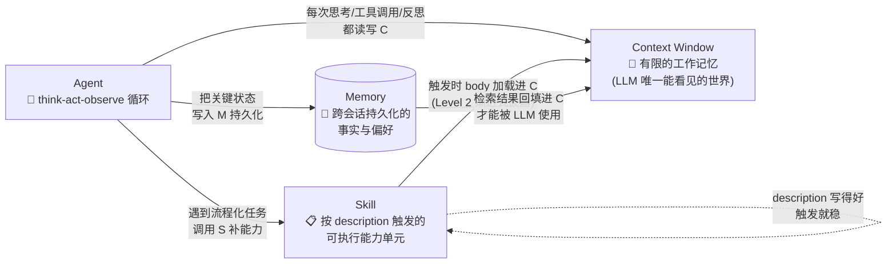

# 🔗 三个概念的关系：Context、Agent、Skill

> 不是知识点的复述，是把这三个概念**当成一个系统**看的时候，我会怎么理解它们的咬合关系。

---

## 一句话定性

**Context（上下文窗口）是 Agent 的"工作内存"，Agent 是在这块有限内存里反复读写的进程，Skill 是给这个进程按需加载的"专家手册"——专门解决"Agent 内存不够装下所有知识"这件事。**

把三者放在一起看，它们的关系不是并列的，是**层级依赖**的：Skill 依赖 Context 来承载，Agent 依赖 Context 来运行，Context 是它们共同的舞台，也是共同的瓶颈。

---

## 一、上下文如何影响 Agent 的工作

我倾向于把 Agent 看成"一个永远在 context window 里反复折腾的进程"。每一次思考、每一次工具调用、每一次反思，都不是凭空发生的——它们都要挤进 context 里才能被 LLM 看见。理解这一点，很多 Agent 的"玄学问题"就豁然开朗。

### 1. Context 是 Agent 的实际"内存"，不是装饰

很多人做 Agent 时盯着 prompt 怎么写、tool 怎么定义，却忽略了一个朴素事实：**LLM 看不到任何不在 context 里的东西**。这意味着：

- **多轮对话历史**占 context
- **每一次工具调用的输入参数**占 context
- **每一次工具调用的输出结果**占 context（往往是大头——一份 PDF 解析出来就是几万 token）
- **Agent 自己生成的 planning 步骤**占 context
- **反思 / self-critique 的中间产物**占 context
- **预留的输出空间**也占 context

一个跑了 30 步的 Agent，context 里的内容可能是：系统提示 + 用户原始问题 + 30 步历史 + 30 次工具结果 + 多份反思。**这就是为什么"Agent 跑久了变笨"——不是模型变笨了，是 context 满了，前面关键的指令被挤到中间塌陷区（Lost in the Middle）。**

### 2. 我观察到的几个"context 瓶颈症状"

在实践里，我会先看是不是 context 出了问题，再去看 prompt / 模型 / 框架：

| 症状 | 真正的根因（往往是 context） |
| --- | --- |
| Agent 后半程开始"忘记"早期指令 | 早期指令被挤到 context 中段，U-shape 效应导致读取不准 |
| Agent 重复调用同一个工具 | 上一次的 tool result 被新内容挤掉了，Agent 看不到自己已经做过 |
| Agent 给出与 system prompt 矛盾的输出 | system prompt 在 context 开头位置仍然能被读到，但**权重分配**已被后续大量 tool output 稀释 |
| Agent 单步正确但整体跑偏 | 单步 context 够用，但跨步的全局规划已经在 context 里"散架"——典型 plan-then-execute 失败模式 |
| 长任务后期速度变慢、token 暴涨 | KV cache 满、attention 计算成本按 O(N²) 上升，与 context 长度非线性相关 |

### 3. 解决 context 瓶颈的几种思路（按推荐度排序）

| 策略 | 适用场景 | 我的判断 |
| --- | --- | --- |
| **Skill 按需加载** | 流程固定的知识（部署、PR 描述、合规审查） | ⭐⭐⭐⭐⭐ 我最推荐的"长期投资"——一次写好，永久受益 |
| **Prompt caching** | 大段 system prompt + 工具 schema 不变 | ⭐⭐⭐⭐ 立刻省钱，但要选支持缓存的 API |
| **上下文压缩 / 摘要** | 长对话、多步 Agent | ⭐⭐⭐⭐ 适合历史压缩，不适合关键决策信息 |
| **RAG 替代大 context** | 需要引用大量文档 | ⭐⭐⭐⭐⭐ 工业标配，但 retrieval 质量决定上限 |
| **子 Agent 隔离** | 复杂任务、多关注点 | ⭐⭐⭐⭐ 隔离 context 防止污染，但编排成本上升 |
| **滑窗截断** | 长会话 | ⭐⭐ 简单但粗暴，关键信息可能恰好被截掉——兜底用 |

---

## 二、Skill 如何沉淀可复用的任务知识

我觉得 Skill 这个抽象最妙的地方，是它正面回答了一个长期困扰 Agent 工程的问题：**"我知道该怎么做这件事，但每次都要重新告诉 Agent。"**

### 1. Skill 是"团队知识 → Agent 行为"的翻译层

在没有 Skill 之前，团队知识（比如"我们的部署流程必须先跑测试、然后通知 #devops 频道、然后合并 PR"）要么靠每次手动写进对话，要么靠塞进 CLAUDE.md 让所有会话都背一遍。前者不可复用，后者浪费 context。

Skill 的设计把这事变成：

- **Description（约 100 token）**：常驻 context，告诉 LLM "我有这个能力"
- **Body（约 5K token）**：触发时才加载，详细指令只在需要时占用 context
- **Supporting files**：更深层的细节（脚本、模板），按引用加载

这本质上是一种**渐进式信息披露**（progressive disclosure）。它和人类大脑调用专业知识的模式很像：你不会记住 Linux kernel 全部源码，但你**记得**"哦，这个我得去查 man page"。

### 2. Skill 沉淀的到底是什么

我观察下来，团队真正会用 Skill 沉淀下来的，是这几类知识：

| 知识类型 | 为什么适合做成 Skill | 反例（不该做成 Skill） |
| --- | --- | --- |
| 重复性多步流程（部署、PR 生成、报表生成） | 步骤固定、容易写错 | 一次性的临时操作 |
| 团队规范（命名、注释、commit message） | 多人需要一致 | 个人风格偏好 |
| 领域专家知识（合规规则、术语表） | LLM 默认不懂你的领域 | 通用常识 |
| 已知陷阱（"绝对不要调用 X API"） | 防止 Agent 重蹈覆辙 | 模型自己推理得出来的 |
| 工具使用范式（"用 y 工具而不是 z"） | 默认行为不符合团队偏好 | 行业通用做法 |

**反过来说：** 如果一个"知识"是"高频但每次都不同"的（比如"帮我写邮件"），做成 Skill 会让 description 触发混乱——Skill 适合的是**"低频但流程固定"** 的事。

### 3. Skill 和 Memory 的本质区别

这两个经常被混，但**它们解决的问题完全不同**：

| 维度 | Skill | Memory |
| --- | --- | --- |
| **写入者** | 人类 / 团队（author-curated） | Agent 自己（agent-curated） |
| **触发方式** | 按 description 匹配 | 按内容相似度检索 |
| **生命周期** | 长期、跨会话、跨用户 | 长期，但通常会话级或用户级 |
| **内容性质** | 流程化、可执行的步骤 | 事实性、上下文相关的信息 |
| **类比** | 团队 SOP 文档 | 个人笔记 / CRM |

Agent Skills 这个开放标准（agentskills.io）目前没有把"自动记忆"放进 Skill 范畴。在我看来这是对的——两者职责分明，混在一起反而难维护。

---

## 三、三者作为一个系统

我用一张图把关系画清楚：

**关键不变量：** **任何时刻，Agent 实际能"看见"并"思考"的，只有 context window 里那一块**。Skill 和 Memory 都只是为这一块提供内容的来源——Skill 是结构化的人工知识，Memory 是检索回来的事实。

---

## 四、把它们串起来：一个具体的场景

**场景：** 用户让 Agent "帮我在本仓库里新建一个标准化的 GitHub Issue 模板"

| 步骤 | Agent 在做什么 | Context 发生了什么 |
| --- | --- | --- |
| 1 | 读 description 匹配到 `gen-issue-template` Skill | Skill body (~5K token) 加载进 context |
| 2 | 读 system prompt + Skill 指令 + 当前 issue 模板 | context = system + skill + 用户请求 |
| 3 | 调用 `Read` 工具看仓库现有 issue 模板 | tool result (3K token) 进 context |
| 4 | 调用 `WebFetch` 看团队 issue 规范 | tool result (5K token) 进 context |
| 5 | 生成新模板 | 输出 (2K token) 进 context |
| 6 | 反思（"我的模板符合 Skill body 第 3 步要求吗？"） | 反思内容进 context |
| 7 | 调用 `Write` 工具写入文件 | tool result 进 context |
| 8 | 把"用户偏好某种格式"记到 Memory | 关键状态写出去（不进 context） |

**总 context 占用峰值：约 20K token**——本来可以放下，但因为按需加载 Skill（避免其他无关 Skill 占 context）、压缩 tool result（避免把整个仓库都读进来）、关键状态写 Memory（避免每次都重复），这个任务在 200K 窗口里跑得很从容。

**如果不用 Skill 会怎样：** 整个"如何生成标准化 issue"的指令必须长期躺在 CLAUDE.md 或 system prompt 里——5K token 每次会话都被占着，几十个 Skill 就是几十万 token 的固定开销。这就是 Skill 设计要解决的根本问题。

---

## 五、我对这套关系的判断

如果只能让我说一句话作为收尾，我想说：

> **做 Agent 工程，上下文不是资源是约束；Skill 不是文档是减负；Memory 不是日志是缓存。**

把三者位置摆对：
- 把"需要每次都在的"放 system prompt
- 把"流程化但不必每次都在的"放 Skill
- 把"会变的事实和偏好"放 Memory
- 让 Agent 在有限的 context 里做最有价值的事

这三层做对了，Agent 工程的复杂度会肉眼可见地下降。做错了任何一个，context 就开始"漏"，然后你就会看到我前面列的那张症状表开始应验。

---
*作者：Zxz124，基于 ai-concept-learning-hub 项目内三张学习卡片的二次整合与个人判断。引用前请保留本文件出处。*